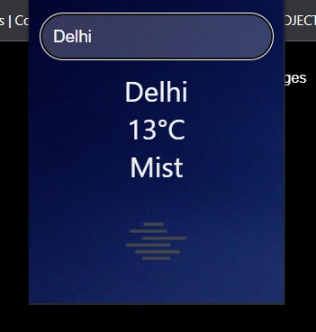

# Weather-Crome-Extension

Weather crome Extension which extracts the weather Data from an open api and shows results in the task bar as other crome extension show.

The data that the forecast is showing is the data that is being extracted from an API known as openWeatherAPI.

## Chrome Extension's execution on taskbar.

## Working Page of the Crome Extension.

